# Keystone Analysis Summary

## X Error Statistics (32x32 Resolution)

### 0415 (SN: UID1747655863)

| Condition                         | Mean X Error | Max X Error (abs) | Comment                                     |
|:----------------------------------|-------------:|------------------:|:--------------------------------------------|
| No correction (selected zone)     |      0.5978° |            2.4908°|                                             |
| + (all zones, SNR>=20)            |      0.6471° |            1.5409°| data much more stable, Max error reduced    |
| + FOV correction 0x02 (X=2, Y=0)  |      0.0826° |            0.9311°| error was shifted around 0                  |
| + focal length 576um              |      0.0753° |            0.3884°| Tilt line was rotated back to horizontal    |

### 0417 (SN: UID1821715)

| Condition                         | Mean X Error | Max X Error (abs) | Comment                                     |
|:----------------------------------|-------------:|------------------:|:--------------------------------------------|
| No correction (selected zone)     |     -2.4716° |            4.0999°|                                             |
| + (all zones, SNR>=20)            |     -1.8978° |            2.4563°|                                             |
| + FOV correction 0x0c (X=0, Y=3)  |     -0.1863° |            0.5685°|                                             |
| + Focal Lengh 568um               |     -0.2107° |            0.3849°|                                             |

---

# Keystone Analysis - 0415 (device SN: UID1747655863)

All files in this folder were generated by the commands below.

## Plot Each Resolution Keystone Error (Online Log)

```bash
python ./tools/compute_keystone_error.py -r ./data/keystone/0415/keystone_8x8_sofn.txt   -k ./data/keystone/0415/keystone_8x8_log.txt   -j ./data/keystone/0415/tmf8829_UID1747655863-2026-04-15-10-46-27.json.gz
python ./tools/compute_keystone_error.py -r ./data/keystone/0415/keystone_16x16_sofn.txt -k ./data/keystone/0415/keystone_16x16_log.txt -j ./data/keystone/0415/tmf8829_UID1747655863-2026-04-15-11-02-47.json.gz
python ./tools/compute_keystone_error.py -r ./data/keystone/0415/keystone_32x32_sofn.txt -k ./data/keystone/0415/keystone_32x32_log.txt -j ./data/keystone/0415/tmf8829_UID1747655863-2026-04-15-11-16-26.json.gz
python ./tools/compute_keystone_error.py -r ./data/keystone/0415/keystone_48x32_sofn.txt -k ./data/keystone/0415/keystone_48x32_log.txt -j ./data/keystone/0415/tmf8829_UID1747655863-2026-04-15-11-29-34.json.gz
```

## Plot All Resolution Keystone Error (Online Log)

```bash
python ./tools/plot_x_error_combined.py -i ./data/keystone/0415/.output
```

## Offline Calculate Keystone Error

Offline calculation uses the exact same function as online processing.

### Without FOV Correction by Selected Zone

```bash
python ./tools/offline_calc_keystone.py -i ./data/keystone/0415/.output/
```

**Result:** `offline_x_error_combined.png`, `offline_y_error_combined.png`

- **Mean X Error (32x32): 0.5978°**
- **Max X Error (32x32, abs): 2.4908°**

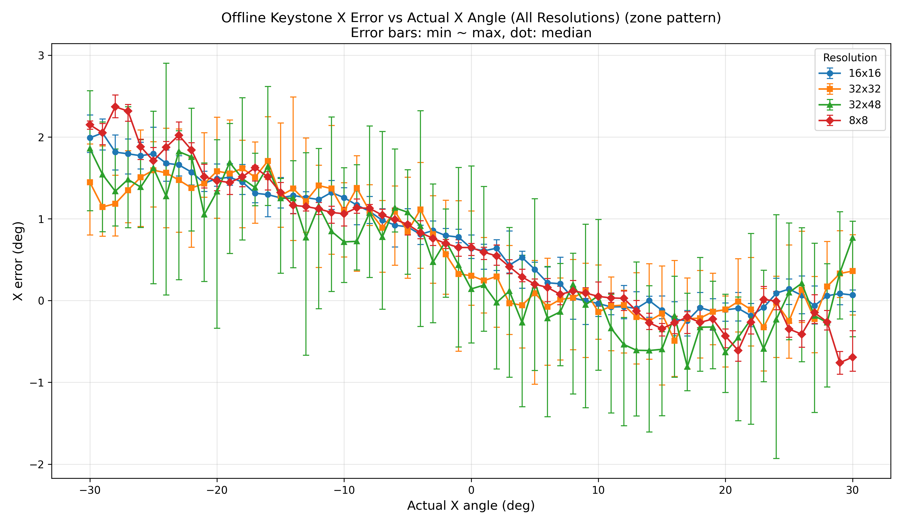
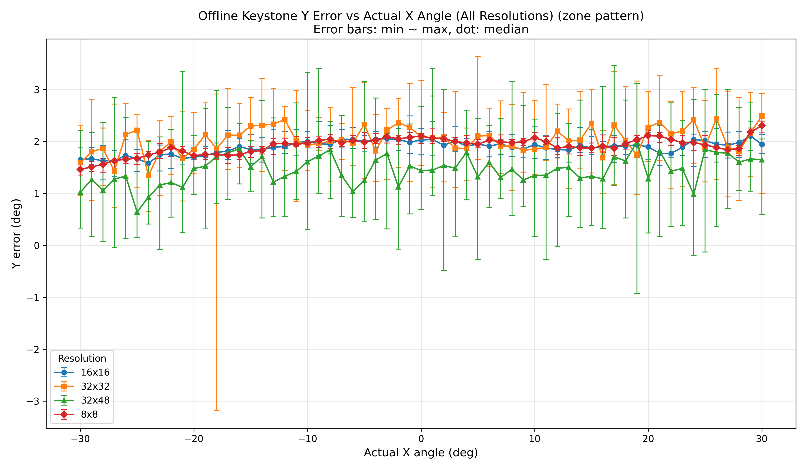

### Without FOV Correction by All Non-Zero Zones and SNR >= 20

```bash
python ./tools/offline_calc_keystone.py -i ./data/keystone/0415/.output/ -a
```

**Result:** `offline_x_error_combined_allzones_snr20.png`, `offline_y_error_combined_allzones_snr20.png`

- **Mean X Error (32x32): 0.6471°**
- **Max X Error (32x32, abs): 1.5409°**

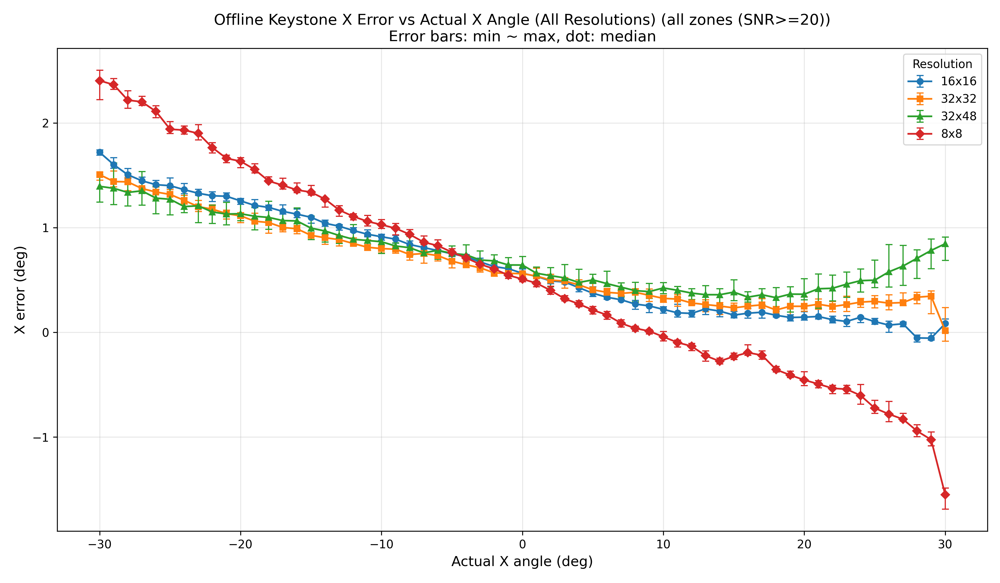
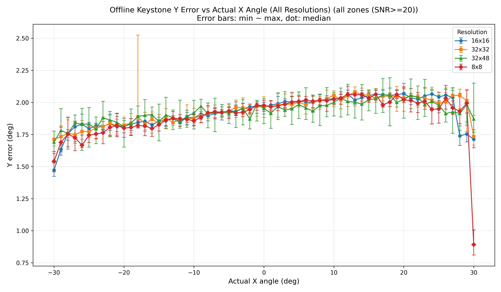

### With FOV Correction by All Non-Zero Zones and SNR >= 20

```bash
python ./tools/offline_calc_keystone.py -i ./data/keystone/0415/.output/ -a -f -v 0x02
```

**Result:** `offline_x_error_combined_fov_corr_allzones_snr20.png`, `offline_y_error_combined_fov_corr_allzones_snr20.png`

- **Mean X Error (32x32): 0.0826°**
- **Max X Error (32x32, abs): 0.9311°**

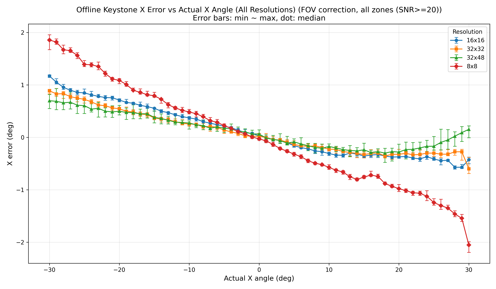
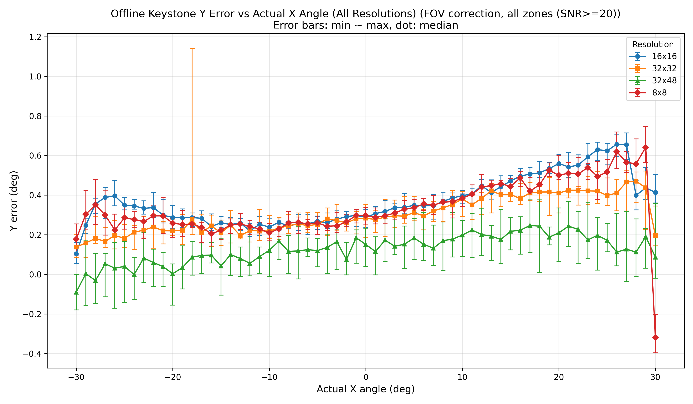

### With FOV Correction by All Non-Zero Zones and SNR >= 20 and Focal Length = 576um

```bash
python ./tools/offline_calc_keystone.py -i ./data/keystone/0415/.output/ -a -f -v 0x02 -l 576
```

**Result:** `offline_x_error_combined_fov_corr_allzones_snr20_fl576.png`, `offline_y_error_combined_fov_corr_allzones_snr20_fl576.png`

- **Mean X Error (32x32): 0.0753°**
- **Max X Error (32x32, abs): 0.3884°**

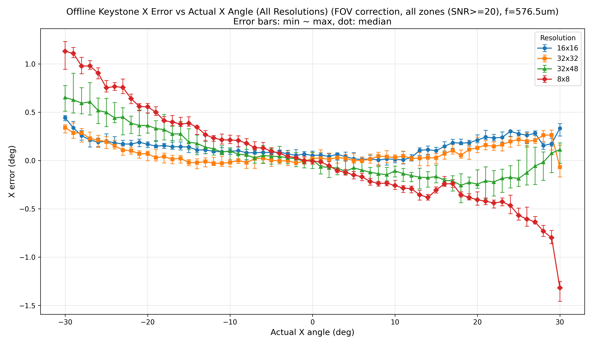
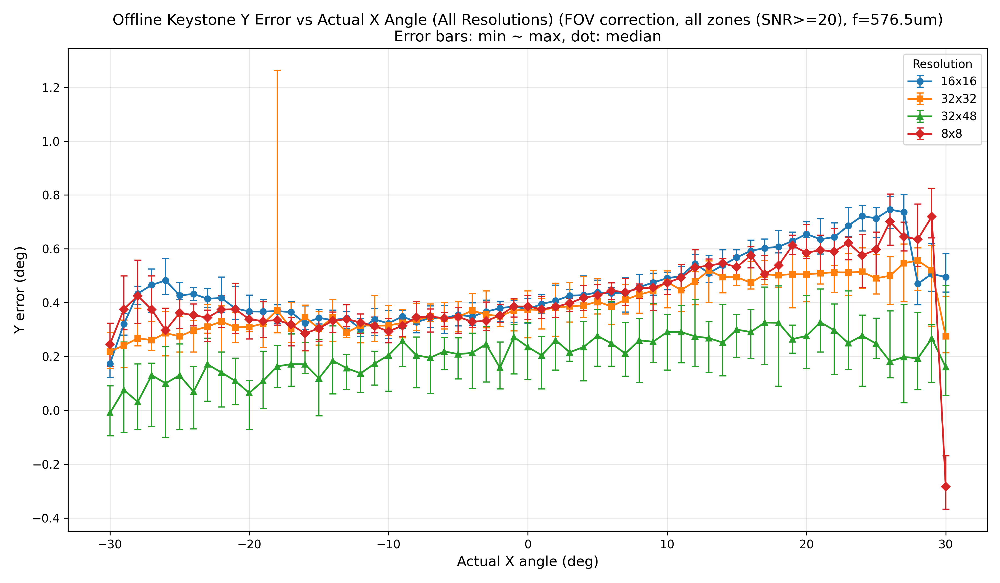

# Keystone Analysis - 0417 (device SN: UID1821715)

All files in this folder were generated by the commands below.

## Plot Each Resolution Keystone Error (Online Log)

```bash
python ./tools/compute_keystone_error.py -r ./data/keystone/0417/keystone_8x8_sofn.txt   -k ./data/keystone/0417/keystone_8x8_log.txt   -j ./data/keystone/0417/tmf8829_UID1821715-2026-04-17-10-26-58.json.gz
python ./tools/compute_keystone_error.py -r ./data/keystone/0417/keystone_16x16_sofn.txt -k ./data/keystone/0417/keystone_16x16_log.txt -j ./data/keystone/0417/tmf8829_UID1821715-2026-04-17-10-40-19.json.gz
python ./tools/compute_keystone_error.py -r ./data/keystone/0417/keystone_32x32_sofn.txt -k ./data/keystone/0417/keystone_32x32_log.txt -j ./data/keystone/0417/tmf8829_UID1821715-2026-04-17-10-53-01.json.gz
python ./tools/compute_keystone_error.py -r ./data/keystone/0417/keystone_48x32_sofn.txt -k ./data/keystone/0417/keystone_48x32_log.txt -j ./data/keystone/0417/tmf8829_UID1821715-2026-04-17-11-05-36.json.gz
```

## Plot All Resolution Keystone Error (Online Log)

```bash
python ./tools/plot_x_error_combined.py -i ./data/keystone/0417/.output
```

## Offline Calculate Keystone Error

Offline calculation uses the exact same function as online processing.

### Without FOV Correction by Selected Zone

```bash
python ./tools/offline_calc_keystone.py -i ./data/keystone/0417/.output/
```

**Result:** `offline_x_error_combined.png`, `offline_y_error_combined.png`

- **Mean X Error (32x32): -2.4716°**
- **Max X Error (32x32, abs): 4.0999°**

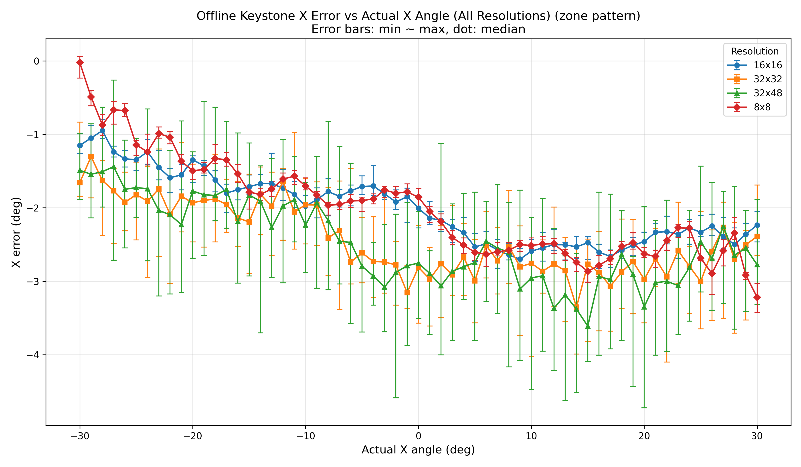
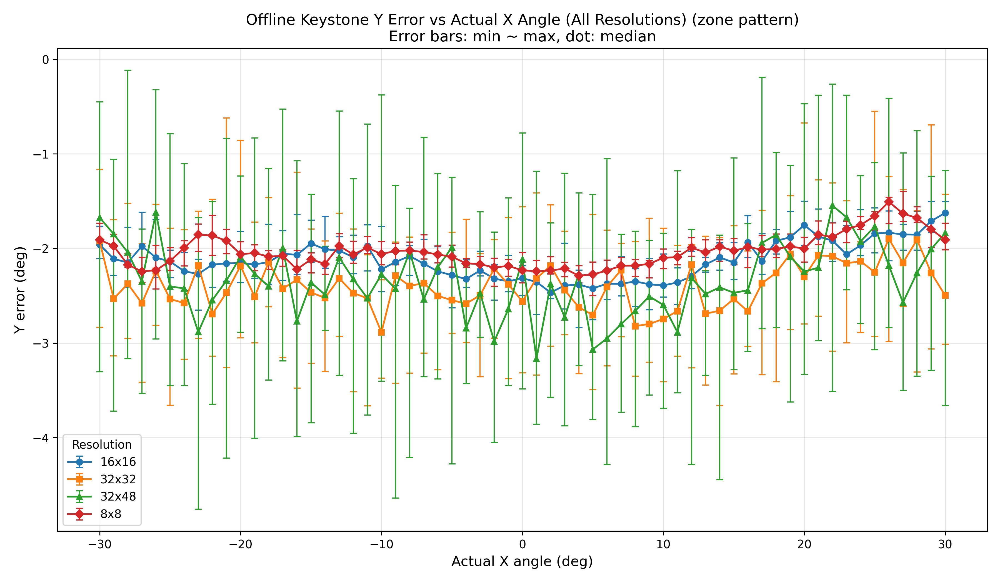

### Without FOV Correction by All Non-Zero Zones and SNR >= 20

```bash
python ./tools/offline_calc_keystone.py -i ./data/keystone/0417/.output/ -a
```

**Result:** `offline_x_error_combined_allzones_snr20.png`, `offline_y_error_combined_allzones_snr20.png`

- **Mean X Error (32x32): -1.8978°**
- **Max X Error (32x32, abs): 2.4563°**

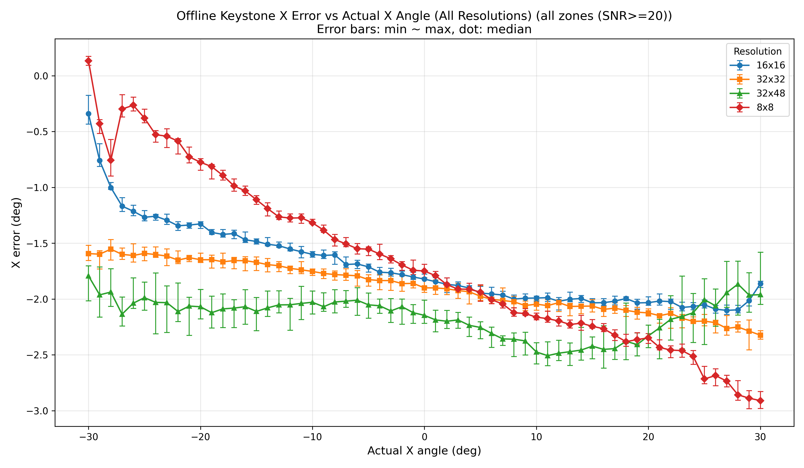
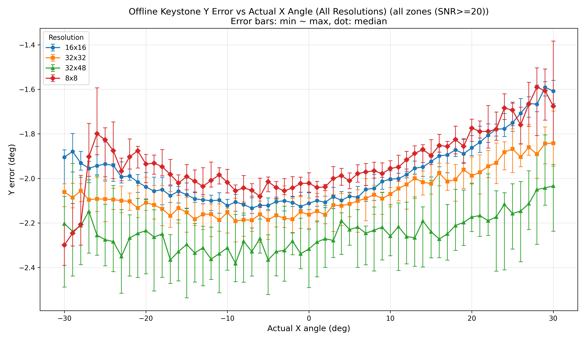

### With FOV Correction by All Non-Zero Zones and SNR >= 20

```bash
python ./tools/offline_calc_keystone.py -i ./data/keystone/0417/.output/ -a -f -v 0x0c
```

**Result:** `offline_x_error_combined_fov_corr_allzones_snr20.png`, `offline_y_error_combined_fov_corr_allzones_snr20.png`

- **Mean X Error (32x32): -0.1863°**
- **Max X Error (32x32, abs): 0.5685°**

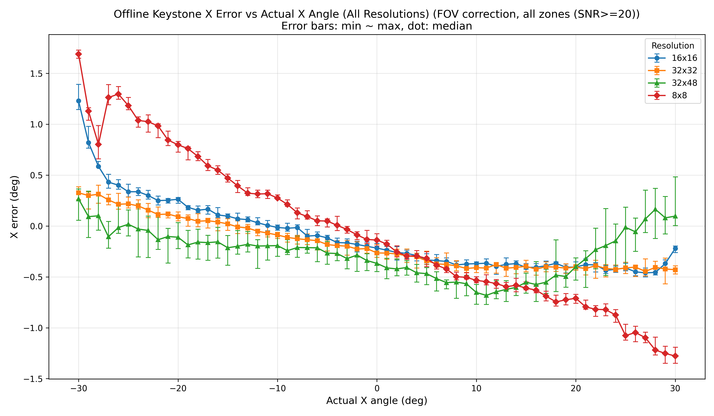
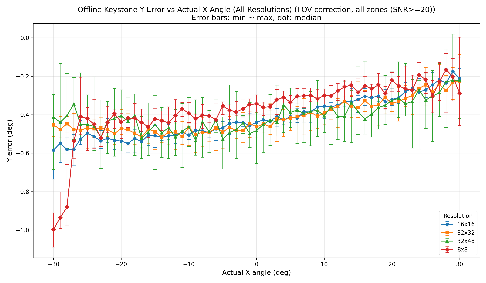

### With FOV Correction by All Non-Zero Zones and SNR >= 20 and Focal Length = 568um

```bash
python ./tools/offline_calc_keystone.py -i ./data/keystone/0417/.output/ -a -f -v 0x0c -l 568
```

**Result:** `offline_x_error_combined_fov_corr_allzones_snr20_fl568.png`, `offline_y_error_combined_fov_corr_allzones_snr20_fl568.png`

- **Mean X Error (32x32): -0.2107°**
- **Max X Error (32x32, abs): 0.3849°**

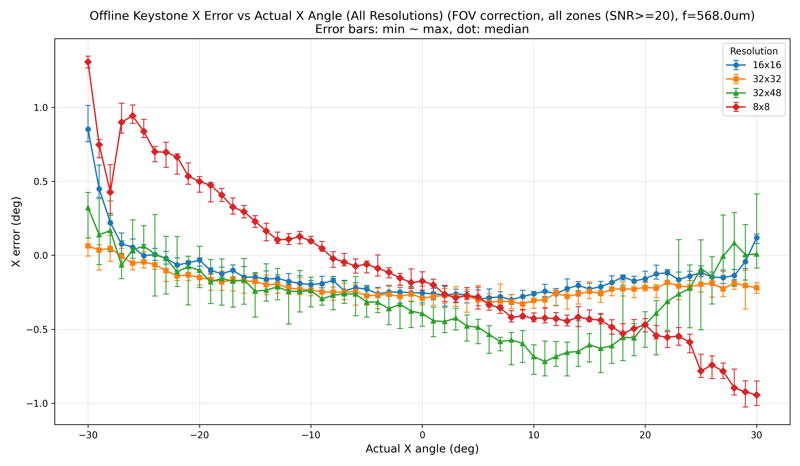

